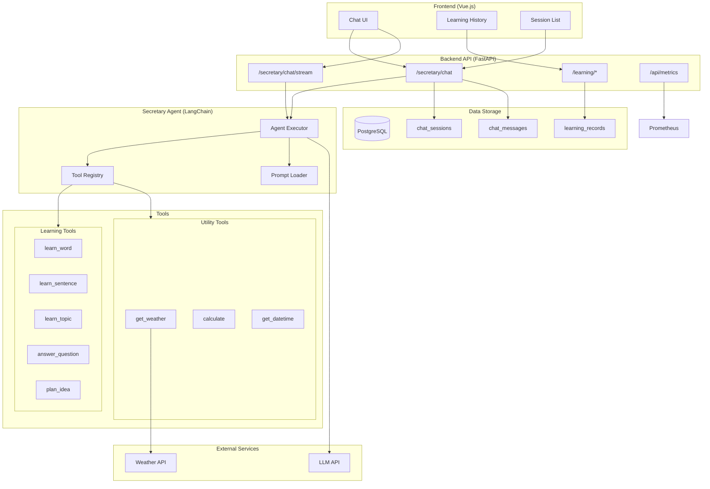
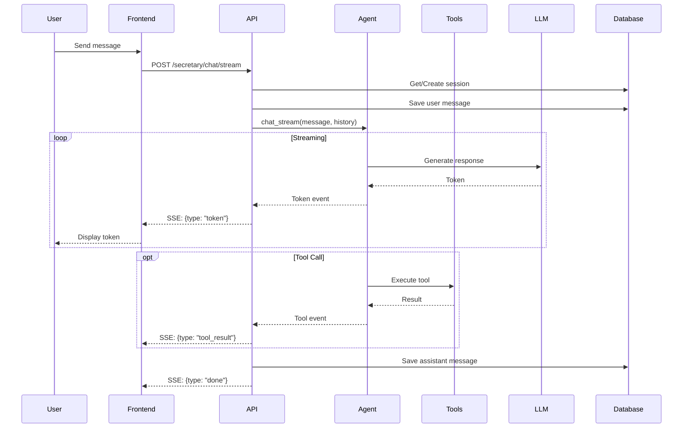
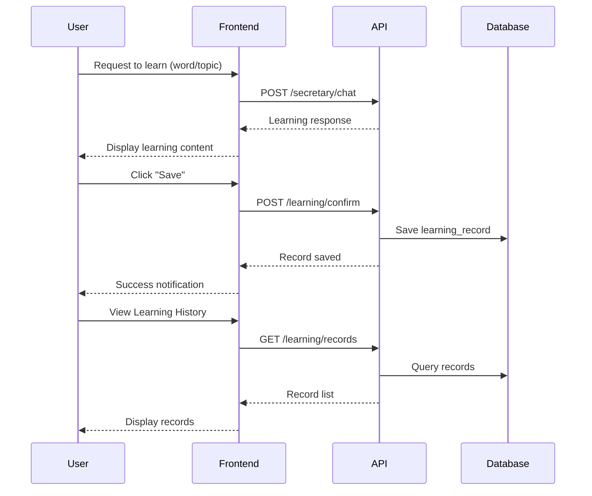
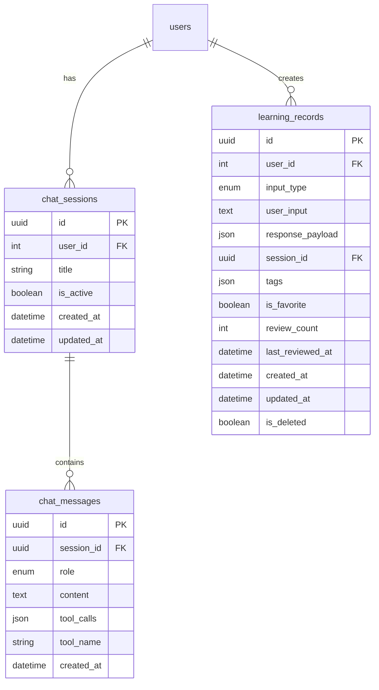

# Personal Secretary Agent - Architecture

## Overview

The Personal Secretary is an AI-powered assistant that helps users:
- Learn English (words, sentences)
- Learn new tech topics
- Answer questions and plan ideas
- Manage daily tasks with utility tools

## System Architecture

## Data Flow

### Chat Request Flow

### Learning Record Flow

## Database Schema

## Key Design Decisions

### 1. LangChain for Agent Framework
- **Decision**: Use LangChain with tool-calling agent
- **Rationale**: Mature ecosystem, good LLM integration, streaming support
- **Trade-offs**: Larger dependency footprint

### 2. YAML Prompt Templates
- **Decision**: Externalize prompts to YAML files
- **Rationale**: Easy to modify without code changes, supports hot-reload
- **Trade-offs**: Runtime file I/O, potential parsing errors

### 3. Self-Hosted LLM Support
- **Decision**: Support self-signed SSL certificates via `LLM_VERIFY_SSL` setting
- **Rationale**: Enterprise deployments often use internal CAs
- **Trade-offs**: Potential security considerations if misused

### 4. Structured Logging with Tracing
- **Decision**: Implement `@trace_llm_call` and `@trace_tool_call` decorators
- **Rationale**: Observability for debugging and monitoring
- **Trade-offs**: Slight performance overhead

### 5. Learning Records with User Confirmation
- **Decision**: Require explicit user confirmation before saving learning content
- **Rationale**: User control over what gets saved, avoid noise
- **Trade-offs**: Extra user interaction step

## Configuration

### Environment Variables

| Variable | Description | Default |
|----------|-------------|---------|
| `LLM_PROVIDER` | LLM provider name | `openai` |
| `LLM_BASE_URL` | LLM API base URL | - |
| `LLM_API_KEY` | LLM API key | - |
| `LLM_MODEL` | Model name | `gpt-4o` |
| `LLM_VERIFY_SSL` | Verify SSL certificates | `true` |
| `LLM_TIMEOUT` | Request timeout in seconds | `60` |

## Metrics

### RED Metrics
- `secretary_chat_requests_total` - Total chat requests by method and status
- `secretary_chat_request_duration_seconds` - Chat request duration histogram
- `secretary_chat_first_token_latency_seconds` - Time to first token
- `secretary_chat_errors_total` - Errors by type

### Tool Metrics
- `secretary_tool_calls_total` - Tool calls by name and status
- `secretary_tool_call_duration_seconds` - Tool execution duration

### Business Metrics
- `secretary_learning_records_total` - Learning records by type
- `secretary_learning_reviews_total` - Review counts
- `secretary_sessions_created_total` - Sessions created
- `secretary_messages_total` - Messages by role

### Resource Metrics
- `secretary_active_sessions` - Active session count
- `secretary_active_streams` - Active streaming connections

## API Endpoints

### Chat
- `POST /api/v1/secretary/chat` - Non-streaming chat
- `POST /api/v1/secretary/chat/stream` - Streaming chat (SSE)
- `GET /api/v1/secretary/sessions` - List sessions
- `GET /api/v1/secretary/sessions/{id}` - Get session with messages
- `DELETE /api/v1/secretary/sessions/{id}` - Delete session
- `GET /api/v1/secretary/tools` - List available tools

### Learning
- `POST /api/v1/learning/confirm` - Save learning record
- `GET /api/v1/learning/records` - List records with filters
- `GET /api/v1/learning/records/{id}` - Get single record
- `PATCH /api/v1/learning/records/{id}` - Update record
- `DELETE /api/v1/learning/records/{id}` - Delete record
- `GET /api/v1/learning/search` - Search records
- `POST /api/v1/learning/records/{id}/review` - Mark as reviewed
- `POST /api/v1/learning/records/{id}/favorite` - Toggle favorite
- `GET /api/v1/learning/statistics` - Get statistics
