# AI-Driven Workflow Engine - High Level Design (Mermaid Diagrams)

**Project:** Lazy Rabbit Agent - AI Workflow Automation
**Version:** 1.0 (Mermaid Edition)
**Date:** 2025-11-18
**Document Type:** High Level Design with Mermaid Diagrams
**Status:** Design Review

---

## Table of Contents

1. [System Architecture Diagrams](#1-system-architecture-diagrams)
2. [Innovation Points Diagrams](#2-innovation-points-diagrams)
3. [Core Components Diagrams](#3-core-components-diagrams)
4. [Data Architecture Diagrams](#4-data-architecture-diagrams)
5. [Integration Architecture Diagrams](#5-integration-architecture-diagrams)
6. [AI/ML Architecture Diagrams](#6-aiml-architecture-diagrams)
7. [Deployment Diagrams](#7-deployment-diagrams)

---

## 1. System Architecture Diagrams

### 1.1 Layered Architecture Overview

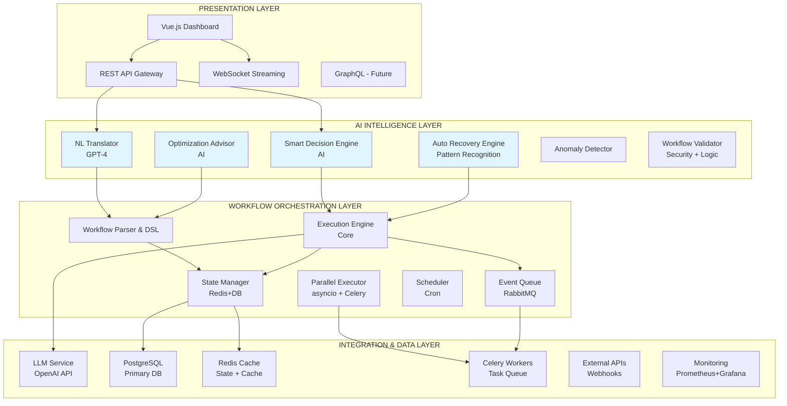

### 1.2 Request Flow - Workflow Creation

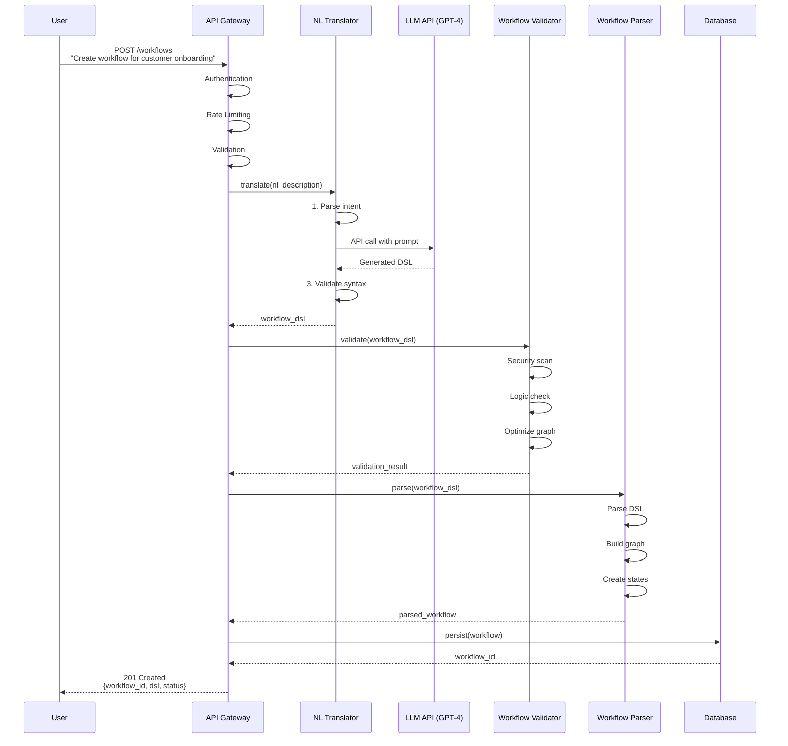

### 1.3 Request Flow - Workflow Execution

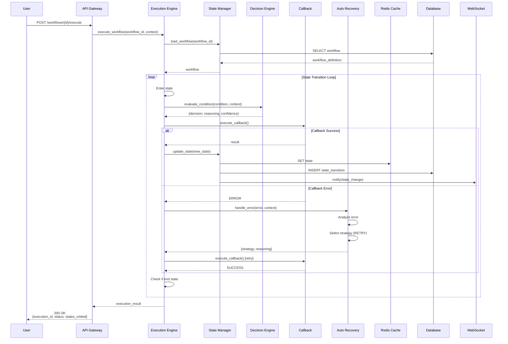

### 1.4 Data Flow Architecture

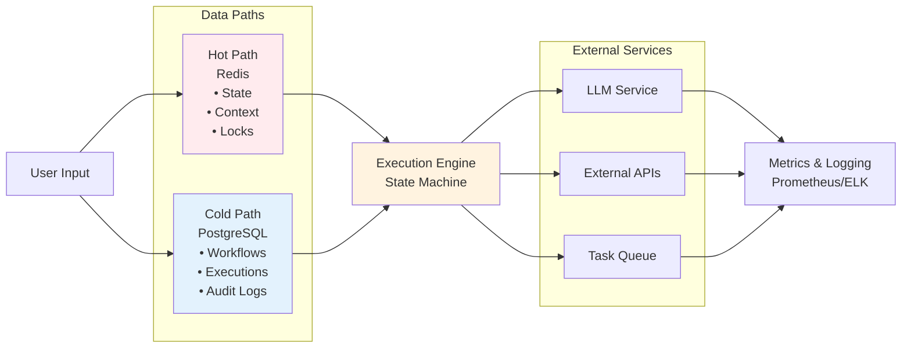

---

## 2. Innovation Points Diagrams

### 2.1 Natural Language Translation Pipeline

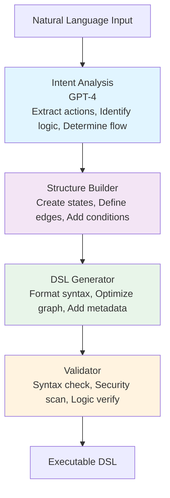

### 2.2 Smart Decision Engine Architecture

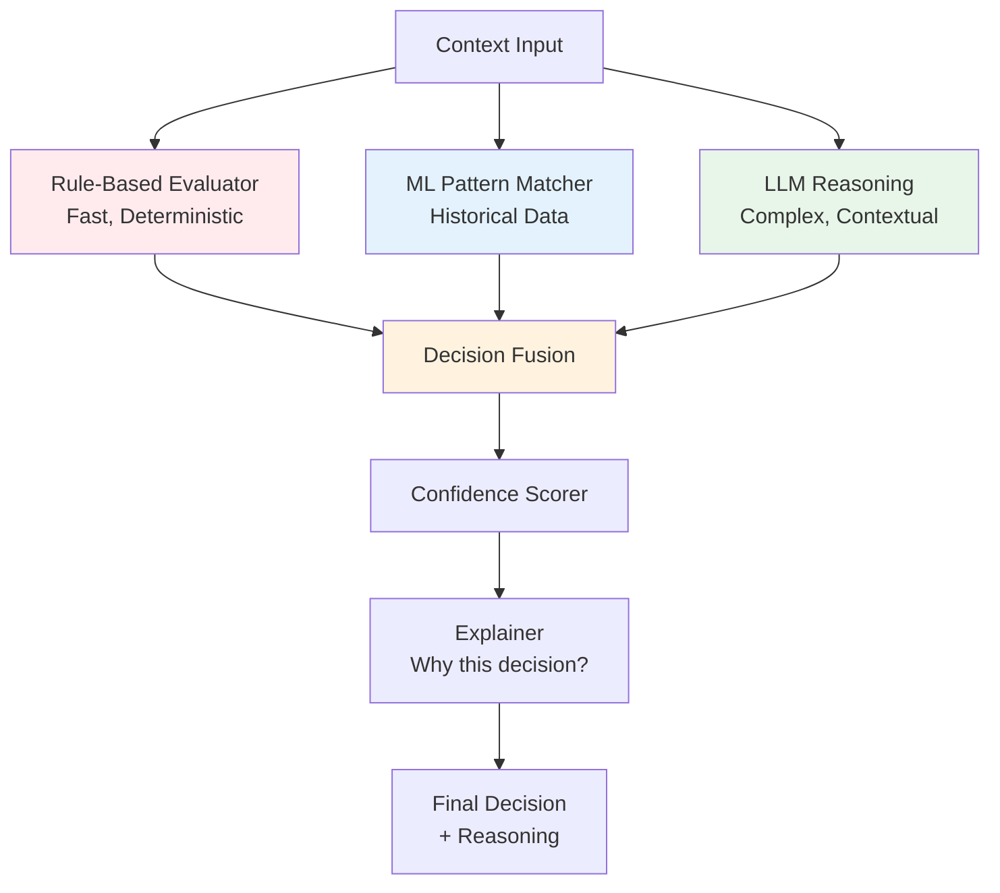

### 2.3 Auto-Recovery Flow

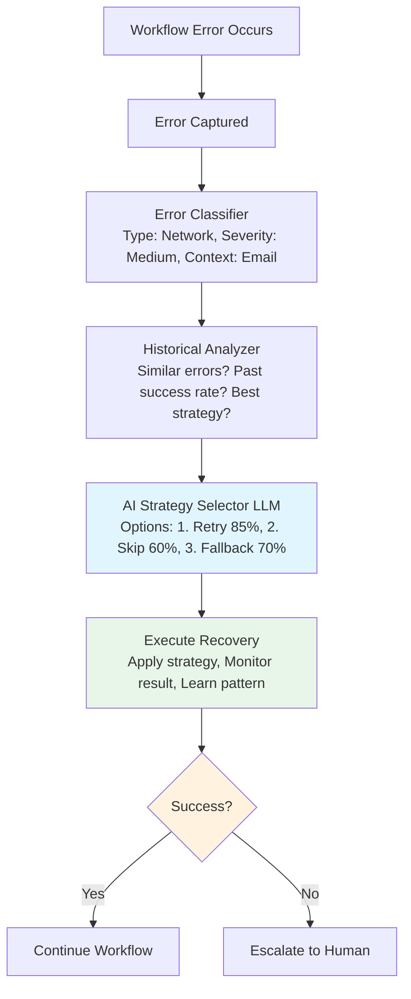

### 2.4 Continuous Optimization Cycle

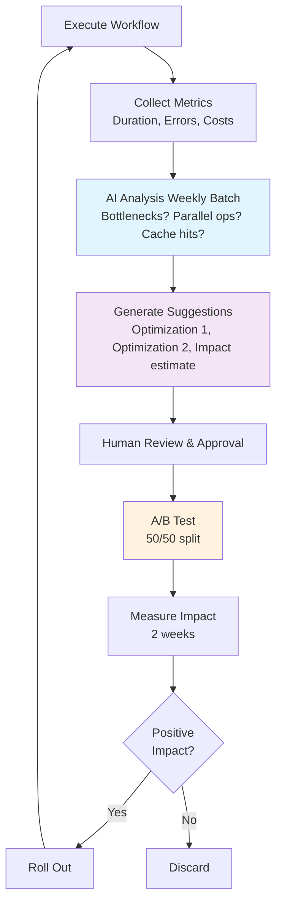

---

## 3. Core Components Diagrams

### 3.1 Class Diagram - Core Components

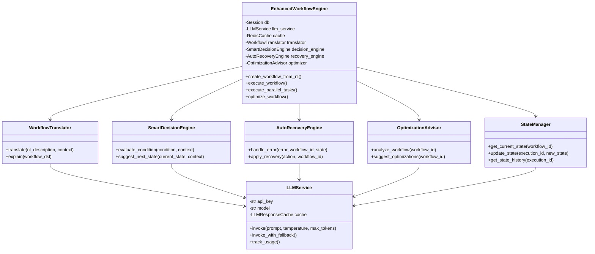

### 3.2 Sequence Diagram - Workflow Execution with Error Recovery

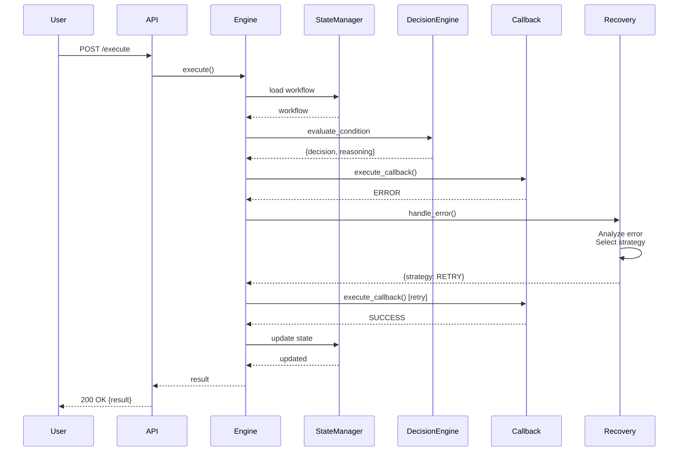

### 3.3 State Machine Diagram

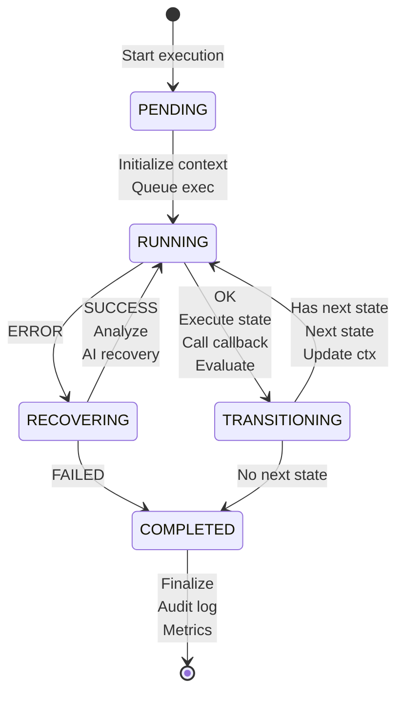

### 3.4 Component Diagram - AI Intelligence Layer

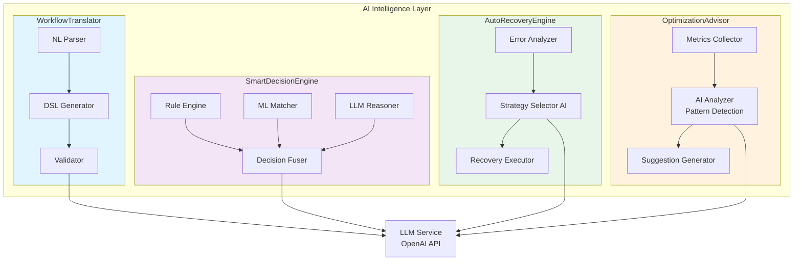

---

## 4. Data Architecture Diagrams

### 4.1 Entity-Relationship Diagram

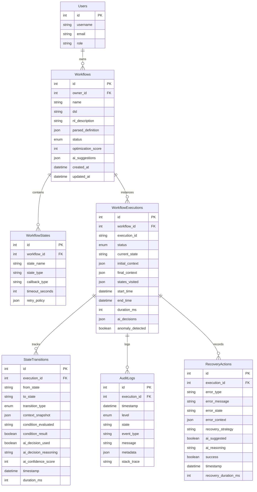

### 4.2 Data Storage Layers

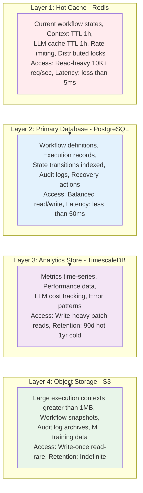

---

## 5. Integration Architecture Diagrams

### 5.1 Integration Points

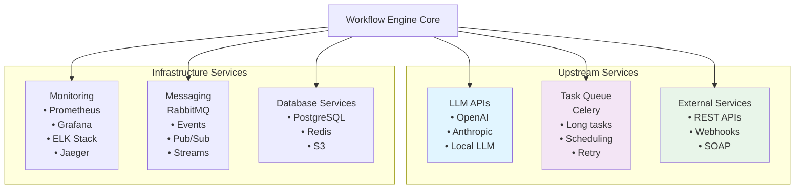

### 5.2 API Gateway Pattern

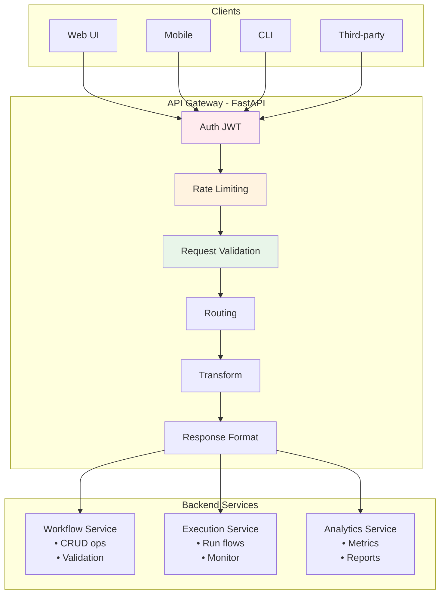

---

## 6. AI/ML Architecture Diagrams

### 6.1 LLM Service Architecture

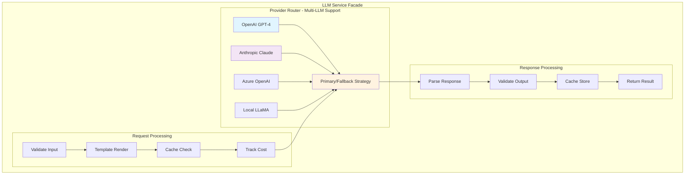

### 6.2 Prompt Engineering Pipeline

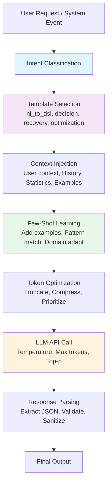

### 6.3 AI Decision Confidence Scoring

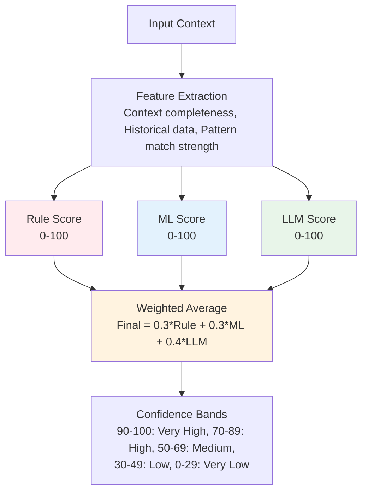

---

## 7. Deployment Diagrams

### 7.1 Kubernetes Deployment Architecture

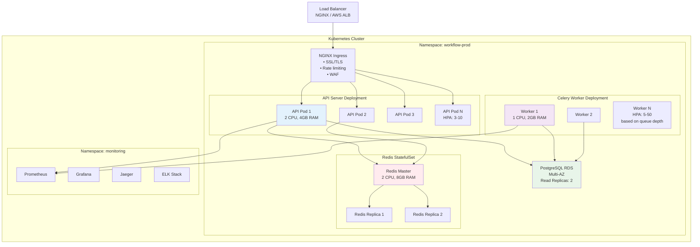

### 7.2 Horizontal Scaling Architecture

```mermaid
graph TD
    LB[Load Balancer<br/>NGINX / AWS ALB]

    subgraph "API Server Pods"
        Pod1[API Pod 1]
        Pod2[API Pod 2]
        Pod3[API Pod 3]
        PodN[API Pod N]
    end

    Redis[Redis Cluster<br/>Shared State / Cache]

    PostgreSQL[PostgreSQL Primary<br/>+ Read Replicas 2x]

    subgraph "Celery Workers"
        Worker[Celery Worker Pool<br/>Auto-scaling: 5-50]
    end

    LB --> Pod1
    LB --> Pod2
    LB --> Pod3
    LB --> PodN

    Pod1 --> Redis
    Pod2 --> Redis
    Pod3 --> Redis
    PodN --> Redis

    Redis --> PostgreSQL

    PostgreSQL --> Worker

    Triggers[Scaling Triggers:<br/>• CPU greater than 70%: Add pod<br/>• Memory greater than 80%: Add pod<br/>• Queue depth greater than 100: Add worker<br/>• Response time greater than 1s: Scale up]

    style Triggers fill:#fff3e0
    style Pod1 fill:#e3f2fd
    style Worker fill:#f3e5f5
```

### 7.3 CI/CD Pipeline

```mermaid
graph LR
    GitPush[Git Push]

    GitPush --> CI[GitHub Actions /<br/>GitLab CI]

    CI --> Build[Stage 1: Build<br/>• Lint code<br/>• Unit tests<br/>• Build Docker]

    Build --> Test[Stage 2: Test<br/>• Integration<br/>• Security scan<br/>• Performance]

    Test --> Staging[Stage 3: Staging<br/>• Deploy staging<br/>• Smoke tests<br/>• Load tests]

    Staging --> Approval[Stage 4: Approval<br/>• Manual review<br/>• QA sign-off]

    Approval --> Prod[Stage 5: Production<br/>• Blue/green<br/>• Canary 10%<br/>• Monitor<br/>• Full rollout]

    style Build fill:#e3f2fd
    style Test fill:#f3e5f5
    style Staging fill:#fff3e0
    style Prod fill:#e8f5e9
```

### 7.4 Multi-Level Caching Strategy

```mermaid
graph TD
    Request[Request]

    Request --> L1{L1: Memory<br/>LRU, 5 min}

    L1 -->|Hit 5%| Return1[Return immediately]
    L1 -->|Miss| L2{L2: Redis<br/>1 hour}

    L2 -->|Hit 60%| Return2[Return less than 10ms]
    L2 -->|Miss| L3{L3: Database<br/>permanent}

    L3 -->|Hit 95%| Return3[Return less than 50ms]
    L3 -->|Miss| L4[L4: Compute<br/>LLM/Callback]

    L4 --> Generate[Generate 100%]
    Generate --> CacheAll[Cache all levels]
    CacheAll --> Return4[Return result]

    style L1 fill:#ffebee
    style L2 fill:#e3f2fd
    style L3 fill:#f3e5f5
    style L4 fill:#e8f5e9
```

### 7.5 Disaster Recovery Strategy

```mermaid
graph TD
    subgraph "Recovery Objectives"
        RTO[RTO: 1 hour]
        RPO[RPO: 15 minutes]
        Retention[Data Retention:<br/>90 days hot<br/>1 year cold]
    end

    subgraph "Backup Strategy"
        subgraph "Database"
            DB1[Continuous replication<br/>to standby sync]
            DB2[Automated snapshots<br/>every 6 hours]
            DB3[Point-in-time recovery<br/>15 min granularity]
            DB4[Cross-region backup<br/>daily]
        end

        subgraph "Redis"
            R1[AOF persistence<br/>append-only file]
            R2[RDB snapshots<br/>every hour]
            R3[Replication to<br/>standby cluster]
        end

        subgraph "S3"
            S1[Cross-region<br/>replication]
            S2[Versioning<br/>enabled]
            S3Lifecycle[Lifecycle policies<br/>archive after 90 days]
        end
    end

    subgraph "Failure Scenarios"
        F1[Single Pod Failure<br/>Detection: less than 30s<br/>Recovery: Automatic K8s<br/>Impact: None]

        F2[AZ Failure<br/>Detection: less than 1 min<br/>Recovery: Automatic multi-AZ<br/>Impact: Minimal latency spike]

        F3[Region Failure<br/>Detection: less than 5 min<br/>Recovery: Manual DNS failover<br/>Impact: 15-60 min downtime]

        F4[Database Failure<br/>Detection: less than 1 min<br/>Recovery: Promote standby<br/>Impact: less than 15 min]
    end

    style DB1 fill:#e3f2fd
    style R1 fill:#ffebee
    style S1 fill:#e8f5e9
    style F1 fill:#f3e5f5
```

---

## Summary

This document provides all the architecture diagrams from the HLD in Mermaid format, making them:

1. **Editable**: Easy to modify and update
2. **Renderable**: Can be viewed in GitHub, GitLab, Notion, and many markdown viewers
3. **Version-controllable**: Track changes in git
4. **Interactive**: Some viewers support zoom and pan
5. **Exportable**: Can be exported to PNG, SVG, PDF

### Diagram Categories

- **7 System Architecture diagrams** - Layered architecture, request flows, data flows
- **4 Innovation diagrams** - NL translation, decision engine, auto-recovery, optimization
- **4 Core Component diagrams** - Class, sequence, state machine, component diagrams
- **2 Data Architecture diagrams** - ER diagram, storage layers
- **2 Integration diagrams** - Integration points, API gateway
- **3 AI/ML Architecture diagrams** - LLM service, prompt engineering, confidence scoring
- **5 Deployment diagrams** - Kubernetes, scaling, CI/CD, caching, disaster recovery

**Total: 27 Mermaid diagrams** covering all aspects of the AI-driven workflow engine architecture.

---

**Document Version:** 1.0
**Last Updated:** 2025-11-18
**Status:** Ready for Review
