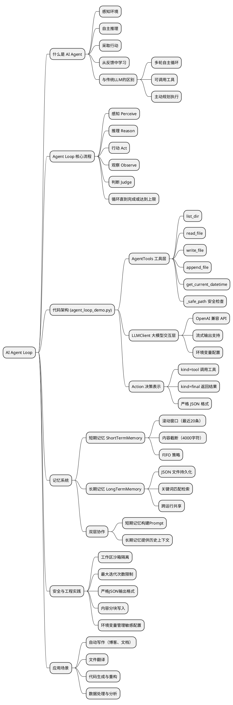

# 深入理解 AI Agent Loop：从一个极简示例说起

> 本文以真实可运行的 Python 脚本 `agent_loop_demo.py` 为例，剖析 AI 智能体循环（Agent Loop）的核心原理与实现。

---

## 一、什么是 AI Agent？

AI Agent（智能体）是一个能够**感知环境、自主推理、采取行动并从反馈中学习**的软件系统。它具备：

- **自主决策**：根据上下文自行决定下一步操作
- **工具使用**：调用外部工具（读写文件、搜索等）
- **迭代推理**：通过多轮循环逐步完成复杂任务
- **记忆管理**：维护短期和长期记忆

| 特性 | 传统 LLM 调用 | AI Agent |
|------|-------------|----------|
| 交互模式 | 单轮请求-响应 | 多轮自主循环 |
| 工具使用 | 无 | 可调用多种工具 |
| 决策能力 | 被动回答 | 主动规划与执行 |
| 错误处理 | 用户手动重试 | 自动感知并调整 |


---

## 二、Agent Loop 核心概念

Agent Loop（智能体循环）是 AI Agent 的核心运行机制，遵循经典模式：

```
感知(Perceive) → 推理(Reason) → 行动(Act) → 观察(Observe) → 再推理 → ...
```

1. **感知**：接收用户任务指令，收集环境信息
2. **推理**：LLM 分析当前状态，决定下一步行动
3. **行动**：执行工具调用（如读文件、写文件等）
4. **观察**：获取工具执行结果，作为新的上下文
5. **判断**：决定是继续循环还是返回最终结果

循环持续进行，直到 Agent 认为任务完成（返回 `final`），或达到最大迭代次数。

---

## 三、agent_loop_demo.py 架构总览

`agent_loop_demo.py` 是一个约 500 行的 Python 脚本，实现了一个完整的 Agent Loop。其核心架构如下：

```
┌─────────────────────────────────────────────┐
│                  主程序 main()               │
│  解析参数 → 初始化组件 → 启动 agent_loop()  │
└──────────────────┬──────────────────────────┘
                   │
       ┌───────────┼───────────────┐
       ▼           ▼               ▼
  LLMClient   AgentTools    Memory 系统
  (LLM交互)   (工具执行)   (短期+长期记忆)
```

### 核心类一览

| 类名 | 职责 |
|------|------|
| `AgentTools` | 提供文件操作工具（list_dir, read_file, write_file, append_file, get_current_datetime） |
| `LLMClient` | 封装 OpenAI 兼容的 LLM API 调用 |
| `ShortTermMemory` | 滚动窗口式短期记忆 |
| `LongTermMemory` | 持久化长期记忆（JSON 文件） |
| `Action` | 数据类，表示 LLM 的决策（工具调用或最终结果） |
| `ToolResult` | 数据类，封装工具执行结果 |


---

## 四、核心组件逐一拆解

### 4.1 AgentTools —— 工具层

`AgentTools` 是 Agent 与外部世界交互的桥梁。它提供了五个工具，每个工具都返回 `ToolResult` 对象：

```python
@dataclass
class ToolResult:
    for_llm: str    # 返回给 LLM 的文本（用于下一轮推理）
    for_user: str   # 返回给用户的文本（用于界面展示）
    ok: bool = True # 执行是否成功
```

五个工具的功能：

| 工具 | 功能 | 参数 |
|------|------|------|
| `list_dir(path)` | 列出目录内容 | 目录路径 |
| `read_file(path)` | 读取文件内容 | 文件路径 |
| `write_file(path, content)` | 写入文件 | 路径 + 内容 |
| `append_file(path, content)` | 追加内容到文件 | 路径 + 内容 |
| `get_current_datetime()` | 获取当前时间 | 无 |

**安全路径检查**是 `AgentTools` 的关键设计：

```python
def _safe_path(self, raw_path: str) -> Path:
    candidate = (self.workspace / raw_path).resolve()
    if not str(candidate).startswith(str(self.workspace)):
        raise ValueError(
            f"Path escapes workspace: {raw_path!r}"
        )
    return candidate
```

这个方法确保所有文件操作都被限制在工作区目录内，防止路径遍历攻击（如 `../../etc/passwd`）。

### 4.2 LLMClient —— 大模型交互层

`LLMClient` 封装了与 OpenAI 兼容 API 的交互逻辑：

```python
class LLMClient:
    def __init__(self, api_base, model, api_key, temperature=0.2):
        self.client = OpenAI(
            api_key=self.api_key,
            base_url=self.api_base,
        )

    def complete(self, messages: List[Dict[str, str]]) -> str:
        # 调用 LLM API，返回文本响应
        ...
```

关键设计点：
- 支持任何 OpenAI 兼容的端点（OpenAI、Claude、本地模型等）
- 通过环境变量配置（`LLM_BASE_URL`、`LLM_API_KEY`、`LLM_MODEL`）
- 支持流式输出（streaming）
- 温度参数可调，默认 0.2 保证输出稳定性


### 4.3 Action —— 决策表示

`Action` 是 LLM 每次推理后输出的结构化决策：

```python
@dataclass
class Action:
    kind: str  # "tool" 或 "final"
    tool_name: Optional[str] = None
    tool_args: Optional[Dict[str, Any]] = None
    final_text: Optional[str] = None
```

LLM 的每次响应必须是严格的 JSON 格式，只有两种可能：

**调用工具：**
```json
{"action":"tool","tool_name":"read_file","tool_args":{"path":"input.md"}}
```

**返回最终结果：**
```json
{"action":"final","final_text":"任务完成，文件已写入 output.md"}
```

这种设计让 Agent 的行为完全可预测、可解析，避免了自由文本带来的不确定性。

---

## 五、Agent Loop 主循环详解

这是整个系统的核心——`agent_loop()` 函数。让我们用伪代码来理解它的运行逻辑：

```python
def agent_loop(task, max_iterations=20):
    # 1. 初始化组件
    tools = AgentTools(workspace)
    llm = LLMClient(api_base, model, api_key)
    short_memory = ShortTermMemory()
    long_memory = LongTermMemory()

    # 2. 构建初始提示
    short_memory.add("user", task)

    # 3. 开始循环
    for i in range(max_iterations):
        # 3a. 组装消息（系统提示 + 记忆 + 任务）
        messages = build_messages(
            system_prompt, short_memory, long_memory, task
        )

        # 3b. 调用 LLM 获取决策
        raw_response = llm.complete(messages)
        action = parse_action(raw_response)

        # 3c. 根据决策类型处理
        if action.kind == "final":
            # 任务完成，保存到长期记忆并返回
            long_memory.add("task_result", action.final_text)
            return action.final_text

        elif action.kind == "tool":
            # 执行工具
            result = execute_tool(tools, action)
            # 将结果加入短期记忆
            short_memory.add("tool_result", result.for_llm)

    # 4. 达到最大迭代次数，强制结束
    return "达到最大迭代次数，任务未完成"
```

### 循环流程图

```
开始任务
  │
  ▼
构建 Prompt（系统提示 + 记忆 + 任务）
  │
  ▼
调用 LLM ──→ 解析 JSON 响应
  │                │
  │          ┌─────┴─────┐
  │          ▼           ▼
  │     kind=tool    kind=final
  │          │           │
  │          ▼           ▼
  │     执行工具      返回结果 ──→ 结束
  │          │
  │          ▼
  │     观察结果写入记忆
  │          │
  └──────────┘（继续下一轮循环）
```


---

## 六、记忆系统：短期与长期

`agent_loop_demo.py` 实现了双层记忆架构，这是 Agent 系统中非常重要的设计。

### 6.1 短期记忆（ShortTermMemory）

短期记忆是一个**滚动窗口**，保存最近的对话和工具调用结果：

```python
class ShortTermMemory:
    def __init__(self, max_items: int = 20):
        self.max_items = max(1, max_items)
        self.items: List[Dict[str, str]] = []

    def add(self, role: str, content: str):
        self.items.append({"role": role, "content": content[:4000]})
        if len(self.items) > self.max_items:
            self.items = self.items[-self.max_items:]

    def render_for_prompt(self) -> str:
        lines = []
        for idx, item in enumerate(self.items, start=1):
            lines.append(f"{idx}. [{item['role']}] {item['content']}")
        return "\n".join(lines)
```

**设计要点：**
- 最多保留 20 条记录，防止 prompt 过长
- 每条内容截断到 4000 字符，控制 token 消耗
- 使用 FIFO（先进先出）策略，自动丢弃最旧的记录

### 6.2 长期记忆（LongTermMemory）

长期记忆持久化到 JSON 文件，跨运行共享：

```python
class LongTermMemory:
    def __init__(self, file_path: Path, max_items: int = 200):
        self.file_path = file_path
        self.items: List[Dict[str, str]] = []
        self._load()  # 从文件加载历史记忆

    def add(self, category: str, content: str):
        entry = {"category": category, "content": content.strip()[:1000]}
        self.items.append(entry)
        self._save()  # 每次添加后持久化

    def recall(self, query: str, top_k: int = 5):
        # 基于关键词匹配的简单检索
        q_terms = set(re.findall(r"[a-zA-Z0-9_\-]+", query.lower()))
        scored = []
        for item in self.items:
            score = sum(1 for t in q_terms if t in item["content"].lower())
            if score > 0:
                scored.append((score, item))
        scored.sort(key=lambda x: x[0], reverse=True)
        return [x[1] for x in scored[:top_k]]
```

**设计要点：**
- 使用 JSON 文件持久化，简单可靠
- `recall()` 方法基于关键词匹配进行检索（生产环境可替换为向量检索）
- 最多保留 200 条，每条截断到 1000 字符
- Agent 完成任务后会自动将结果摘要存入长期记忆

### 6.3 双层记忆的协作

```
┌──────────────────────────────────────┐
│           Agent Loop 每轮迭代        │
│                                      │
│  短期记忆 ──→ 构建 Prompt ──→ LLM   │
│     ▲                          │     │
│     │                          ▼     │
│  工具结果 ←── 执行工具 ←── 解析决策  │
│                                      │
│  长期记忆 ──→ 提供历史上下文         │
│     ▲                                │
│     └── 任务完成时保存结果摘要       │
└──────────────────────────────────────┘
```


---

## 七、安全机制与工程实践

`agent_loop_demo.py` 中体现了多项重要的工程实践：

### 7.1 工作区沙箱

所有文件操作都被限制在指定的工作区目录内：

```python
def _safe_path(self, raw_path: str) -> Path:
    candidate = (self.workspace / raw_path).resolve()
    if not str(candidate).startswith(str(self.workspace)):
        raise ValueError(f"Path escapes workspace: {raw_path!r}")
    return candidate
```

这防止了 Agent 意外或恶意地访问工作区之外的文件系统。

### 7.2 最大迭代次数限制

Agent Loop 设置了最大迭代次数（默认 20 次），防止无限循环：

```python
for i in range(max_iterations):
    # ... 循环体
```

### 7.3 严格的 JSON 输出格式

通过 System Prompt 强制 LLM 只输出 JSON，避免自由文本导致的解析失败：

```
Response format (STRICT JSON only, no markdown fences):
{"action":"tool","tool_name":"...","tool_args":{...}}
或
{"action":"final","final_text":"..."}
```

### 7.4 内容分块写入

对于长内容，Agent 被指导使用分块策略：

```
1. write_file(path, first_chunk)   # 写入第一块
2. append_file(path, next_chunk)   # 追加后续块
3. repeat append_file until done   # 重复直到完成
4. return final                    # 返回结果
```

这避免了单次 API 调用传输过大的 payload。

### 7.5 环境变量配置

所有敏感配置通过环境变量或 `.env` 文件管理：

```bash
LLM_BASE_URL=https://api.openai.com/v1
LLM_API_KEY=your_key
LLM_MODEL=gpt-4o-mini
LLM_TEMPERATURE=0.2
```

---

## 八、运行示例

### 8.1 安装与配置

```bash
# 安装依赖
pip install openai httpx

# 配置环境变量（创建 .env 文件）
cat > .env << EOF
LLM_BASE_URL=https://api.openai.com/v1
LLM_API_KEY=your_key
LLM_MODEL=gpt-4o-mini
EOF
```

### 8.2 运行任务

```bash
# 列出当前目录文件
python agent_loop_demo.py --task "list files in ."

# 写一篇博客
python agent_loop_demo.py --task "Write a blog about AI to blog.md"

# 翻译文件
python agent_loop_demo.py --task "Translate input_en.md to Chinese, save to output_zh.md"
```

### 8.3 执行过程示例

当你运行翻译任务时，Agent 的执行过程大致如下：

```
[第1轮] LLM 决策: 调用 read_file("input_en.md")
        工具结果: 读取到 2000 字符的英文内容

[第2轮] LLM 决策: 调用 write_file("output_zh.md", "<翻译后的前半部分>")
        工具结果: 成功写入 1500 字符

[第3轮] LLM 决策: 调用 append_file("output_zh.md", "<翻译后的后半部分>")
        工具结果: 成功追加 1200 字符

[第4轮] LLM 决策: 返回 final("翻译完成，已保存到 output_zh.md")
        任务结束
```


---

## 九、思维导图总结

以下是本文内容的 PlantUML 思维导图，概括了 AI Agent Loop 的核心知识体系：



---

## 十、总结与展望

### 10.1 核心要点回顾

通过 `agent_loop_demo.py` 这个极简示例，我们看到了一个完整 AI Agent 的核心要素：

1. **循环架构**：Agent 通过「推理 → 行动 → 观察」的循环不断推进任务
2. **工具系统**：Agent 通过调用工具与外部世界交互，扩展了 LLM 的能力边界
3. **结构化通信**：严格的 JSON 格式确保 LLM 输出可被程序可靠解析
4. **记忆管理**：双层记忆系统让 Agent 既能保持当前上下文，又能利用历史经验
5. **安全机制**：沙箱隔离、迭代限制等措施确保 Agent 行为可控

### 10.2 从 Demo 到生产

`agent_loop_demo.py` 虽然只有约 500 行代码，但已经包含了生产级 Agent 系统的核心骨架。要将其发展为生产系统，可以考虑：

- **更丰富的工具集**：添加网络搜索、数据库查询、代码执行等工具
- **更智能的记忆**：用向量数据库替代关键词匹配，实现语义检索
- **多 Agent 协作**：让多个 Agent 分工合作，处理更复杂的任务
- **可观测性**：添加日志、指标、追踪，便于调试和监控
- **人机协作**：在关键决策点引入人工确认机制

### 10.3 最后的话

AI Agent 代表了 LLM 应用的下一个阶段——从「被动回答问题」到「主动完成任务」。理解 Agent Loop 的原理，是构建智能化应用的第一步。希望本文和 `agent_loop_demo.py` 能为你打开这扇大门。

---

*本文基于 `agent_loop_demo.py` 源码分析撰写。完整代码请参考项目仓库。*
