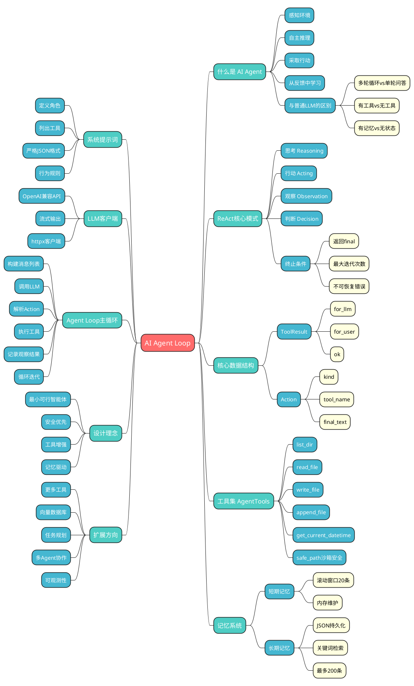

# 深入理解 AI Agent Loop：从一个极简示例说起

> 本文以一个真实可运行的 Python 脚本 `agent_loop_demo.py` 为例，深入剖析 AI 智能体循环（Agent Loop）的核心原理、架构设计与实现细节。

---

## 一、什么是 AI Agent？

### 1.1 定义

AI Agent（人工智能智能体）是一个能够**感知环境、自主推理、采取行动并从反馈中学习**的软件系统。与传统的"一问一答"式聊天机器人不同，Agent 具备以下关键能力：

- **自主决策**：根据当前上下文自行选择下一步操作
- **工具使用**：能够调用外部工具（读写文件、查询数据库、调用 API 等）
- **多步推理**：通过循环迭代，逐步完成复杂任务
- **记忆能力**：维护短期和长期记忆，跨轮次保持上下文

### 1.2 Agent 与普通 LLM 调用的区别

| 特性 | 普通 LLM 调用 | AI Agent |
|------|-------------|----------|
| 交互模式 | 单轮问答 | 多轮循环 |
| 工具使用 | 无 | 有（文件、API、数据库等） |
| 自主性 | 被动响应 | 主动规划与执行 |
| 记忆 | 无状态 | 短期 + 长期记忆 |
| 错误处理 | 用户重试 | 自动观察并修正 |

---

## 二、Agent Loop 的核心思想：ReAct 模式

Agent Loop 的核心思想源自 **ReAct（Reasoning + Acting）** 模式。其基本流程可以概括为：

```
用户任务 -> [LLM推理] -> [选择工具] -> [执行工具] -> [观察结果] -> [LLM再推理] -> ... -> [最终输出]
```

这是一个**循环（Loop）**，每一轮包含以下步骤：

1. **思考（Reasoning）**：LLM 分析当前状态，决定下一步做什么
2. **行动（Acting）**：调用一个工具执行具体操作
3. **观察（Observation）**：获取工具执行的结果
4. **判断（Decision）**：决定是继续循环还是输出最终结果

终止条件：
- LLM 判断任务已完成，返回 `final` 动作
- 达到最大迭代次数（防止无限循环）
- 发生不可恢复的错误

---

## 三、agent_loop_demo.py 架构全景

整个系统由以下核心模块组成：

```
+---------------------------------------------------+
|                  CLI 入口 (main)                   |
|         解析参数 -> 初始化组件 -> 启动循环           |
+-------------------------+-------------------------+
                          |
        +-----------------+-----------------+
        v                 v                 v
  +----------+     +-----------+     +----------+
  | LLMClient|     |AgentTools |     |  Memory  |
  | (推理引擎)|     | (工具集)   |     | (记忆系统)|
  +----------+     +-----------+     +----------+
        |                 |                 |
        +-----------------+-----------------+
                          v
                 +-----------------+
                 |  Agent Loop     |
                 |  (核心循环)      |
                 +-----------------+
```

---

## 四、核心模块详解

### 4.1 数据结构：ToolResult 与 Action

```python
@dataclass
class ToolResult:
    for_llm: str      # 返回给 LLM 的文本（用于下一轮推理）
    for_user: str      # 返回给用户的文本（用于界面展示）
    ok: bool = True    # 操作是否成功

@dataclass
class Action:
    kind: str          # "tool" 或 "final"
    tool_name: Optional[str] = None
    tool_args: Optional[Dict[str, Any]] = None
    final_text: Optional[str] = None
```

**设计亮点**：
- `ToolResult` 区分了 `for_llm` 和 `for_user`，实现了**信息的分层传递**
- `Action` 用 `kind` 字段区分工具调用和最终输出

### 4.2 工具集：AgentTools

`AgentTools` 类提供了 5 个工作空间安全的文件操作工具：

```python
class AgentTools:
    def __init__(self, workspace: Path) -> None:
        self.workspace = workspace.resolve()

    def _safe_path(self, raw_path: str) -> Path:
        candidate = (self.workspace / raw_path).resolve()
        if not str(candidate).startswith(str(self.workspace)):
            raise ValueError(f"Path escapes workspace: {raw_path!r}")
        return candidate

    def list_dir(self, raw_path: str = ".") -> ToolResult: ...
    def read_file(self, raw_path: str) -> ToolResult: ...
    def write_file(self, raw_path: str, content: str) -> ToolResult: ...
    def append_file(self, raw_path: str, content: str) -> ToolResult: ...
    def get_current_datetime(self) -> ToolResult: ...
```

**安全机制 `_safe_path`** 是整个工具系统最重要的安全防线，确保所有文件操作都被限制在工作空间目录内。

每个工具方法都遵循统一的模式：
1. 调用 `_safe_path` 验证路径
2. 执行实际操作
3. 返回 `ToolResult`
4. 用 `try/except` 捕获所有异常

### 4.3 记忆系统：短期记忆 + 长期记忆

#### 短期记忆（ShortTermMemory）

```python
class ShortTermMemory:
    def __init__(self, max_items: int = 20) -> None:
        self.max_items = max(1, max_items)
        self.items: List[Dict[str, str]] = []

    def add(self, role: str, content: str) -> None:
        self.items.append({"role": role, "content": content[:4000]})
        if len(self.items) > self.max_items:
            self.items = self.items[-self.max_items:]

    def render_for_prompt(self) -> str:
        lines = []
        for idx, item in enumerate(self.items, start=1):
            lines.append(f"{idx}. [{item['role']}] {item['content']}")
        return "\n".join(lines)
```

短期记忆是一个**滚动窗口**，保留最近 20 条对话记录，让 LLM 在每一轮推理时都能看到最近的上下文。

#### 长期记忆（LongTermMemory）

```python
class LongTermMemory:
    def __init__(self, file_path: Path, max_items: int = 200) -> None:
        self.file_path = file_path
        self.items: List[Dict[str, str]] = []
        self._load()

    def add(self, category: str, content: str) -> None:
        entry = {"category": category, "content": content.strip()[:1000]}
        self.items.append(entry)
        self._save()

    def recall(self, query: str, top_k: int = 5) -> List[Dict[str, str]]:
        q_terms = set(re.findall(r"[a-zA-Z0-9_\-]+", query.lower()))
        scored = []
        for item in self.items:
            content = item.get("content", "").lower()
            score = sum(1 for t in q_terms if t in content)
            if score > 0:
                scored.append((score, item))
        scored.sort(key=lambda x: x[0], reverse=True)
        return [x[1] for x in scored[:top_k]]
```

长期记忆特点：持久化 JSON 存储、关键词检索、容量限制（200条）。

### 4.4 系统提示词（System Prompt）

```python
SYSTEM_PROMPT = """You are an agent running in a local workspace.
You can choose tools to complete the user's task.

Available tools:
1) list_dir(path: string)
2) read_file(path: string)
3) write_file(path: string, content: string)
4) append_file(path: string, content: string)
5) get_current_datetime()

Response format (STRICT JSON only):
If you need a tool:
{"action":"tool","tool_name":"read_file","tool_args":{"path":"input.md"}}

If done:
{"action":"final","final_text":"Completed."}
"""
```

关键设计：严格 JSON 格式、明确工具签名、清晰终止信号。

### 4.5 LLM 客户端（LLMClient）

```python
class LLMClient:
    def __init__(self, api_base, model, api_key, temperature=0.2):
        self.client = OpenAI(
            api_key=api_key, base_url=api_base,
            http_client=httpx.Client(verify=False, timeout=90.0),
        )

    def complete_with_options(self, messages, stream=False, on_token=None):
        if stream:
            response = self.client.chat.completions.create(
                model=self.model, messages=messages,
                temperature=self.temperature, stream=True)
            collected = []
            for chunk in response:
                token = chunk.choices[0].delta.content or ""
                collected.append(token)
                if on_token: on_token(token)
            return "".join(collected)
        else:
            response = self.client.chat.completions.create(
                model=self.model, messages=messages,
                temperature=self.temperature)
            return response.choices[0].message.content or ""
```

兼容 OpenAI API，支持流式/非流式输出，httpx 自定义客户端。

---

## 五、Agent Loop 主循环

### 5.1 伪代码实现

```python
def run_agent_loop(task: str, max_iterations: int = 20):
    tools = AgentTools(workspace)
    llm = LLMClient(api_base, model, api_key)
    short_memory = ShortTermMemory(max_items=20)
    long_memory = LongTermMemory(file_path)
    short_memory.add("user", task)

    for i in range(max_iterations):
        # 1. 构建消息
        messages = [
            {"role": "system", "content": SYSTEM_PROMPT},
            {"role": "user", "content": build_user_prompt(
                task, short_memory, long_memory)},
        ]
        # 2. 调用 LLM
        raw_response = llm.complete(messages)
        # 3. 解析 Action
        action = parse_action(raw_response)

        if action.kind == "final":
            long_memory.add("task_result", f"task={task}; result={action.final_text}")
            return action.final_text

        if action.kind == "tool":
            result = dispatch_tool(tools, action.tool_name, action.tool_args)
            short_memory.add("assistant_raw", raw_response)
            short_memory.add("tool_result", f"{action.tool_name}: {result.for_llm}")

    return "Reached max iterations."
```

### 5.2 Action 解析容错

```python
def parse_action(raw: str) -> Action:
    try:
        data = json.loads(raw.strip())
    except json.JSONDecodeError:
        match = re.search(r'```(?:json)?\s*(\{.*?\})\s*```', raw, re.DOTALL)
        if match:
            data = json.loads(match.group(1))
        else:
            return Action(kind="final", final_text=raw.strip())
    kind = data.get("action", "final")
    if kind == "tool":
        return Action(kind="tool", tool_name=data.get("tool_name"),
                      tool_args=data.get("tool_args", {}))
    return Action(kind="final", final_text=data.get("final_text", str(data)))
```

---

## 六、完整执行示例

**任务**："将 docs/input_en.md 翻译成中文，保存到 docs/output_zh.md"

```
第 1 轮
  LLM 思考："我需要先读取源文件"
  LLM 输出：{"action":"tool","tool_name":"read_file","tool_args":{"path":"docs/input_en.md"}}
  执行工具：read_file -> 返回文件内容

第 2 轮
  LLM 思考："已读到英文内容，现在翻译并写入"
  LLM 输出：{"action":"tool","tool_name":"write_file","tool_args":{"path":"docs/output_zh.md","content":"..."}}
  执行工具：write_file -> 写入成功

第 3 轮
  LLM 思考："翻译已完成"
  LLM 输出：{"action":"final","final_text":"翻译完成，已保存到 docs/output_zh.md"}

任务完成！
```

---

## 七、关键设计理念

### 7.1 最小可行智能体
约 400 行代码，无复杂框架依赖，核心逻辑清晰可读。

### 7.2 安全优先
沙箱化路径、异常捕获、迭代上限、内容截断。

### 7.3 工具增强
LLM + 工具 = 更强能力边界。

### 7.4 记忆驱动
短期记忆保持上下文，长期记忆积累经验。

---

## 八、如何运行

```bash
# 环境配置 (.env)
LLM_BASE_URL=https://api.openai.com/v1
LLM_API_KEY=your_api_key_here
LLM_MODEL=gpt-4o-mini

# 安装依赖
pip install openai httpx

# 运行
python agent_loop_demo.py --task "list files in ."
python agent_loop_demo.py --task "Write a blog about AI to demo/blog.md"
```

---

## 九、扩展方向

| 扩展方向 | 说明 |
|---------|------|
| 更多工具 | 网络搜索、数据库查询、代码执行 |
| 更好的记忆 | 向量数据库（ChromaDB）替代关键词匹配 |
| 任务规划 | Planning 模块，先制定计划再执行 |
| 多 Agent 协作 | 多个 Agent 分工合作 |
| 更强的安全 | 权限控制、操作审计、内容过滤 |
| 可观测性 | 日志、指标、追踪 |

---

## 十、总结

AI Agent Loop 是构建智能体系统的核心模式。通过 `agent_loop_demo.py` 这个极简示例，我们看到了一个完整 Agent 的五大核心组件：

1. **LLM 客户端**：推理引擎，负责思考和决策
2. **工具集**：Agent 的"手和脚"，负责与外部世界交互
3. **记忆系统**：Agent 的"大脑"，维护上下文和历史经验
4. **系统提示词**：Agent 的"灵魂"，定义角色和行为规范
5. **主循环**：Agent 的"心脏"，驱动推理-行动-观察的循环

其核心都是这个 **感知 -> 推理 -> 行动 -> 观察** 的循环。

---

## 附录：思维导图（PlantUML）



---

> 本文基于 `agent_loop_demo.py` 源码分析撰写。该脚本是一个约 400 行的单文件 Python 程序，实现了一个最小化但功能完整的 ReAct 风格 AI Agent Loop。
